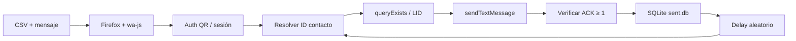

<div align="center">

# WAYLABS OS

## WhatsApp Bulk Sender

**Envío masivo de WhatsApp · Firefox · Node.js · TypeScript**

<sub><strong>DRANDIGITAL S.a.s</strong></sub>

<br />

[](https://nodejs.org/)
[](https://www.typescriptlang.org/)
[](https://playwright.dev/)
[](https://www.sqlite.org/)

</div>

---

## ¿Qué es esto?

Herramienta de **envío masivo controlado** por WhatsApp Web. Automatiza Firefox, respeta delays entre mensajes, evita duplicados con SQLite y soporta contactos **WhatsApp Business** (IDs `@lid`).

> **Solo Firefox.** Chrome y Chromium están bloqueados por diseño.

---

## Requisitos (léelos antes de empezar)

| Requisito | Detalle |
|-----------|---------|
| **Sistema operativo** | Linux, macOS o Windows |
| **Node.js** | Versión **18 o superior** → `node -v` |
| **npm** | Viene con Node → `npm -v` |
| **Internet** | Estable. Sin VPN agresiva si puedes evitarla |
| **WhatsApp** | Cuenta activa en tu teléfono |
| **Consentimiento** | Solo envía a contactos que autorizaron recibir mensajes |

### Lo que NO necesitas

- No instales Chrome ni Chromium.
- No uses `firefox-esr` del sistema (`/usr/bin/firefox-esr`). **No funciona** con Playwright.
- No hace falta API oficial de Meta. Usa WhatsApp Web como un navegador real.

---

## Instalación paso a paso (anti-tontos)

### 1. Clonar el repositorio

```bash
git clone https://github.com/waylabs10-ux/whatsapp-bulk-sender.git
cd whatsapp-bulk-sender
```

### 2. Instalar dependencias

```bash
npm install
```

Esto instala paquetes **y** el Firefox de Playwright automáticamente.

Si falla la descarga de Firefox:

```bash
npm run setup
```

### 3. Crear archivo de configuración

```bash
cp .env.example .env
```

No cambies nada la primera vez. `HEADLESS=false` es lo correcto para ver la ventana y el QR.

### 4. Preparar contactos

Edita `data/contacts.csv`:

```csv
phone,name
3113248642,Juan Pérez
3001234567,María García
```

**Formato del teléfono:**
- Colombia: `3XXXXXXXXX` (10 dígitos, sin +57)
- El sistema agrega `57` automáticamente → `573113248642@c.us`
- Sin espacios, guiones ni paréntesis

### 5. Preparar el mensaje

Edita `data/message.txt`:

```text
Hola {name}, este es un mensaje de prueba desde WAYLABS OS.
```

`{name}` se reemplaza por el nombre del CSV. Si está vacío, usa `estimado/a`.

### 6. Ejecutar

```bash
npm start
```

### 7. Escanear el QR (solo la primera vez)

1. Se abre **Firefox** (ventana de Playwright).
2. En la terminal aparece un **código QR**.
3. En tu teléfono: **WhatsApp → Dispositivos vinculados → Vincular dispositivo**.
4. Escanea el QR.
5. Espera el mensaje: `WhatsApp sincronizado. Listo para enviar.`

La sesión queda guardada en `sessions/`. La próxima vez no pedirá QR (salvo que borres esa carpeta).

---

## Qué verás cuando funciona

```
[19:15:17] WhatsApp sincronizado. Listo para enviar.
[19:15:17] 3 contactos cargados desde CSV
[19:15:17] Iniciando envío masivo a 3 contactos...
[19:15:17] 📤 Enviando 1/3 → 573113248642@c.us
[19:15:22] ✅ Enviado 1/3 - 573113248642@c.us (ack=1, id=true_573...)
[19:15:22]    Destino confirmado por WhatsApp: 573113248642@c.us
[19:15:34] Esperando 12.4s antes del siguiente envío...
...
[19:16:10] ────────── RESUMEN ──────────
[19:16:10] ✅ Enviados:  3
[19:16:10] ⏭️ Saltados:  0
[19:16:10] ❌ Fallidos:  0
```

**`ack=1`** = WhatsApp confirmó que el mensaje salió del servidor. Si no ves `ack=1`, el mensaje puede no haber llegado.

---

## Configuración (`.env`)

```env
SESSION_NAME=bulk-sender
DELAY_MIN_MS=8000      # Espera mínima entre envíos (ms)
DELAY_MAX_MS=20000     # Espera máxima entre envíos (ms)
HEADLESS=false         # false = ver Firefox (recomendado)
QR_TIMEOUT=0           # 0 = esperar QR sin límite
AUTH_TIMEOUT=0
```

| Variable | Qué hace |
|----------|----------|
| `DELAY_MIN_MS` / `DELAY_MAX_MS` | Pausa aleatoria entre contactos. **No los bajes mucho** o WhatsApp puede limitarte. |
| `HEADLESS=false` | Muestra la ventana de Firefox. Usa `true` solo cuando ya tengas sesión guardada y sepas lo que haces. |
| `SESSION_NAME` | Nombre de la carpeta de sesión dentro de `sessions/`. |

---

## Reenviar a todos (segunda ejecución)

El sistema **no reenvía** a contactos ya marcados como exitosos en `data/sent.db`.

Para enviar de nuevo a **todos**:

```bash
rm -f data/sent.db
npm start
```

Si solo quieres reintentar los fallidos, **no borres** `sent.db`. Los fallidos se reintentan solos; los exitosos se omiten.

---

## Solución de problemas

### "Firefox de Playwright no está instalado"

```bash
npm run setup
# o
npx playwright install firefox
```

### No aparece el QR / se queda colgado

```bash
pkill -f firefox || true
rm -rf sessions/bulk-sender
npm start
```

Verifica `HEADLESS=false` en `.env`.

### Error: `Execution context was destroyed` o `wpp is undefined`

Sesión interrumpida por navegación interna. El sistema reintenta solo. Si persiste:

```bash
pkill -f firefox || true
rm -rf sessions/bulk-sender
rm -f data/sent.db
npm start
```

### Solo llegan mensajes a algunos contactos (WhatsApp Business)

Contactos **Business** usan IDs `@lid`. El sistema los resuelve automáticamente con `queryExists` y `getPnLidEntry`. Si falla uno, revisa el log:

```
Contacto WhatsApp Business (ID: 123456789@lid)
```

### `⏭️ Saltando ... - ya enviado`

Ese número ya está en `data/sent.db` como exitoso. Borra la DB si quieres reenviar (ver sección anterior).

### Número inválido omitido

Revisa el CSV: debe ser `3XXXXXXXXX` (Colombia) o número internacional sin símbolos raros.

---

## Arquitectura

```
whatsapp-bulk-sender/
├── src/
│   ├── index.ts          # Punto de entrada
│   ├── firefoxClient.ts  # Playwright + wa-js (envío, auth, Business/LID)
│   ├── firefoxLauncher.ts# Lanza Firefox de Playwright
│   ├── firefox.ts        # Bloqueo Chrome/Chromium
│   ├── sender.ts         # Bucle masivo + delays + resumen
│   ├── tracker.ts        # SQLite: deduplicación y estado
│   ├── csvLoader.ts      # CSV + normalización de teléfonos CO
│   ├── config.ts         # Variables de entorno + logger
│   └── timeouts.ts       # Timeouts y reintentos
├── data/
│   ├── contacts.csv      # Tus contactos
│   ├── message.txt       # Plantilla del mensaje
│   └── sent.db           # Generado al ejecutar (no subir a git)
└── sessions/             # Sesión de WhatsApp Web (no subir a git)
```

### Stack tecnológico

| Componente | Tecnología |
|------------|------------|
| Runtime | Node.js 18+ |
| Lenguaje | TypeScript 5 |
| Automatización | Playwright (Firefox bundled) |
| WhatsApp Web | `@wppconnect/wa-js` + `@wppconnect/wa-version` |
| Persistencia | `better-sqlite3` |
| CSV | `papaparse` |
| QR terminal | `qrcode-terminal` |

### Flujo de envío



---

## Comandos disponibles

| Comando | Descripción |
|---------|-------------|
| `npm install` | Instala dependencias + Firefox Playwright |
| `npm run setup` | Reinstala Firefox de Playwright |
| `npm start` | Ejecuta el envío masivo |
| `npm run build` | Compila TypeScript → `dist/` |
| `npm run start:prod` | Ejecuta versión compilada |

---

## Advertencia legal y de uso

- Usa esta herramienta **solo con contactos que hayan dado consentimiento** explícito.
- El envío masivo no autorizado puede violar los [Términos de Servicio de WhatsApp](https://www.whatsapp.com/legal/terms-of-service).
- **DRANDIGITAL S.a.s** y **WAYLABS OS** no se responsabilizan por uso indebido, bloqueos de cuenta o sanciones de Meta.
- Recomendación: prueba primero con **tu propio número** en el CSV.

---

<div align="center">

<br />

# WAYLABS OS

<sub>Desarrollado por <strong>DRANDIGITAL S.a.s</strong></sub>

<br />

[Reportar un problema](https://github.com/waylabs10-ux/whatsapp-bulk-sender/issues) · [OpenMasive-WAYLABS_OS](https://github.com/waylabs10-ux/OpenMasive-WAYLABS_OS)

</div>
